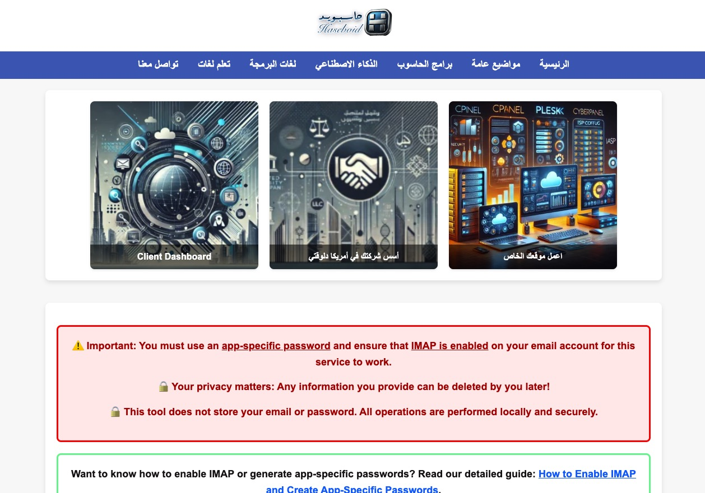

# UnsubGenius - Clean Your Inbox Effortlessly!  


### English | [العربية](#unsubgenius---إدارة-البريد-الإلكتروني-بسهولة)

---

## English Description  

**[UnsubGenius](https://haseboid.com/unsub)** is a simple and efficient tool to clean your inbox from spam and unwanted subscription emails. Built using Flask, this lightweight application automates the process of identifying unsubscribe links and decluttering your inbox in a secure and intuitive manner.

## 🔑 Features  
- **Automated Scanning**: Detects unsubscribe links in your inbox automatically.  
- **One-Click Unsubscription**: Removes you from unwanted mailing lists effortlessly.  
- **IMAP Support**: Compatible with Gmail, Outlook, Yahoo, and other major email providers.  
- **Task Tracking**: Real-time progress updates and a detailed summary of completed actions.  
- **Optional Spam Deletion**: Deletes flagged emails for a cleaner inbox.

## 🔧 How to Use  
### Use now from our live testing website
### Make sure you read the "how-to" first  
1. Visit the live application: [UnsubGenius](https://haseboid.com/unsub).  
2. Log in using your IMAP credentials (e.g., Gmail, Yahoo).  
3. UnsubGenius will scan your inbox, find unsubscribe links, and process them automatically.  
4. Optionally, enable the spam deletion feature for additional cleaning.  
5. View your progress and results in real-time.

## 🌐 References  
- Check out more solutions on [HaseboID](https://haseboid.com).  
- Explore the client dashboard: [serv.haseboid.com](https://serv.haseboid.com).  

## Use on your computer  
```bash
# UnsubGenius Setup Guide
# 1. Clone the repository
git clone https://github.com/mohamedsbadawy/unsubGenius.git
cd unsubgenius

# 2. Create a virtual environment
# Ensure you have Python 3 installed. Replace `venv` with your desired environment name.
python3 -m venv venv

# 3. Activate the virtual environment
# For Linux/Mac:
source venv/bin/activate
# For Windows:
venv\Scripts\activate

# 4. Upgrade pip (recommended)
pip install --upgrade pip

# 5. Install the dependencies
pip install -r requirements.txt

# 6. Run the application
# Set environment variables if required (example for Flask)
export FLASK_APP=app.py
export FLASK_ENV=development

# Start the Flask application
flask run

# 7. Deactivate the virtual environment (when done)
deactivate
```

---

# UnsubGenius - إدارة البريد الإلكتروني بسهولة!  


### [English](#english-description) | العربية

---

## الوصف  

**[UnsubGenius](https://haseboid.com/unsub)** هو أداة بسيطة وفعّالة لتنظيف صندوق البريد الإلكتروني من الرسائل المزعجة والبريد غير المرغوب فيه. تم بناء التطبيق باستخدام Flask ويقدّم حلاً خفيفًا وآمنًا لإدارة بريدك الإلكتروني بسهولة.

## 🔑 الميزات  
- **الفحص التلقائي**: يكتشف روابط إلغاء الاشتراك تلقائيًا في صندوق البريد الخاص بك.  
- **إلغاء الاشتراك بضغطة واحدة**: يزيلك من قوائم البريد غير المرغوب فيها بسهولة.  
- **دعم IMAP**: متوافق مع Gmail وOutlook وYahoo وغيرها من مزودي البريد الإلكتروني.  
- **تتبع المهام**: تحديثات لحظية وتفاصيل شاملة للإجراءات المكتملة.  
- **حذف البريد المزعج**: خيار لحذف البريد المزعج لتحسين صندوق الوارد الخاص بك.

## 🔧 كيفية الاستخدام  
### استخدم الآن من موقعنا للاختبار المباشر
### تأكد من قراءة دليل "كيفية الاستخدام" أولاً  
1. قم بزيارة التطبيق المباشر: [UnsubGenius](https://haseboid.com/unsub).  
2. قم بتسجيل الدخول باستخدام بيانات IMAP (مثل Gmail وYahoo).  
3. سيقوم التطبيق بفحص بريدك الإلكتروني، والعثور على روابط إلغاء الاشتراك، ومعالجتها تلقائيًا.  
4. اختر خيار حذف البريد المزعج إذا كنت ترغب في تنظيف إضافي.  
5. استعرض تقدمك ونتائجك في الوقت الحقيقي.

## 🌐 المراجع  
- استكشف المزيد من الحلول على [HaseboID](https://haseboid.com).  
- قم بزيارة لوحة التحكم: [serv.haseboid.com](https://serv.haseboid.com).  

## استخدم على جهازك  
```bash
# دليل إعداد UnsubGenius
# 1. استنسخ المستودع
git clone https://github.com/mohamedsbadawy/unsubGenius.git
cd unsubgenius

# 2. أنشئ بيئة افتراضية
# تأكد من تثبيت Python 3. استبدل `venv` باسم البيئة التي تريدها.
python3 -m venv venv

# 3. فعّل البيئة الافتراضية
# لأنظمة Linux/Mac:
source venv/bin/activate
# لأنظمة Windows:
venv\Scripts\activate

# 4. قم بترقية pip (موصى به)
pip install --upgrade pip

# 5. تثبيت الاعتمادات
pip install -r requirements.txt

# 6. قم بتشغيل التطبيق
# قم بضبط متغيرات البيئة إذا لزم الأمر (مثل Flask)
export FLASK_APP=app.py
export FLASK_ENV=development

# شغّل تطبيق Flask
flask run

# 7. إلغاء تنشيط البيئة الافتراضية (عند الانتهاء)
deactivate
```

---
**Take control of your inbox now with [UnsubGenius](https://haseboid.com/unsub)!**  
**استعد السيطرة على صندوق بريدك الإلكتروني الآن مع [UnsubGenius](https://haseboid.com/unsub)!**
```
